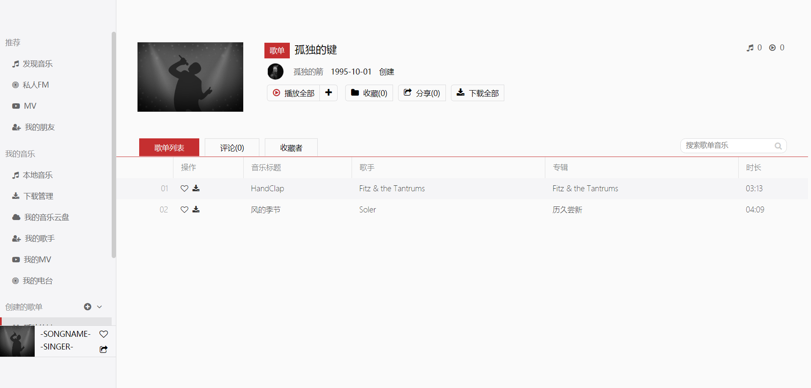

# 网易云音乐 

## 功能特性
1. 音乐搜索
2. 音乐收藏
3. 音乐播放
4. 音乐信息展示




## 环境要求
需要 NodeJS 6.0+ 环境

## 安装  
```
$ npm install
```
## 运行
```
$ node app.js 
```
服务器启动默认端口为3000,若不想使用3000端口,可使用以下命令:  
Mac/Linux
```
$ PORT=4000 node app.js
```

windows 下使用 git-bash 或者 cmder 等终端执行以下命令:  
```
$ set PORT=4000 && node app.js
